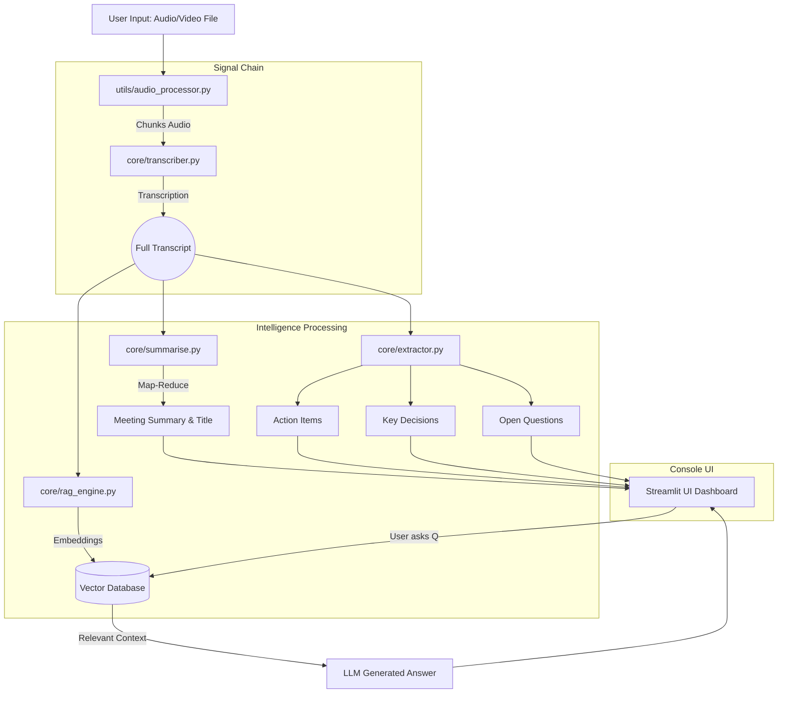
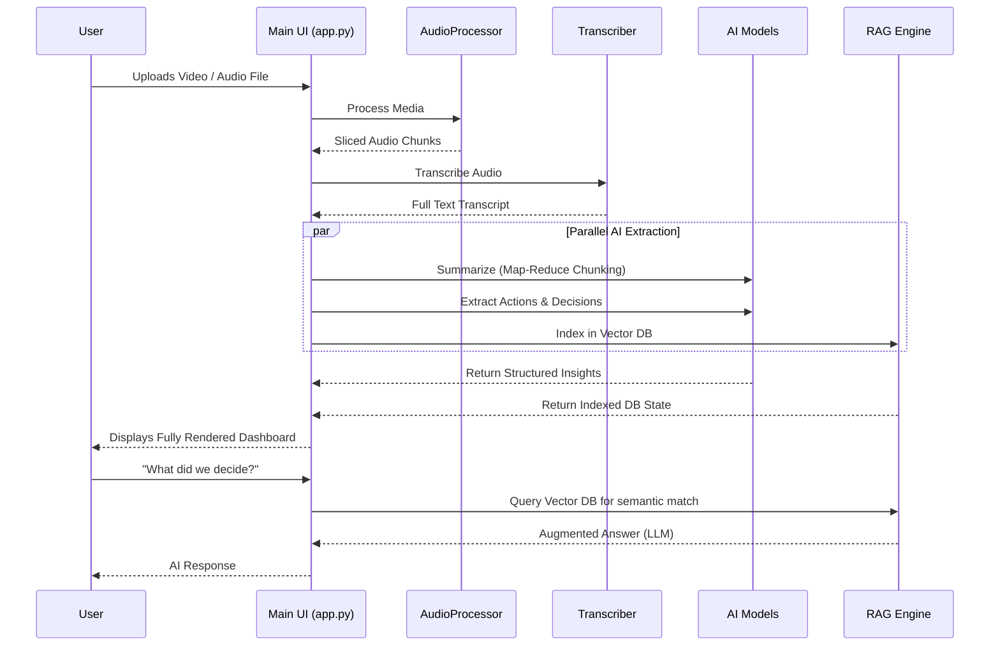

# ▮ MinuteMind


**MinuteMind** turns any meeting recording—whether it's a direct audio file upload or a YouTube URL—into instant summaries, actionable items, key decisions, open questions, and an interactive chatbot that remembers everything discussed.

Designed for unparalleled speed and context awareness, it leverages modern LLMs (Groq / Mistral) and map-reduce architecture to process massive meetings flawlessly without hitting token limits.

---

## ⚡ Features Layer
- **Seamless Ingestion:** Drop a local video or audio file (`.mp3`, `.mp4`, `.wav`, etc.).
  - *Note on YouTube Videos:* Due to YouTube's strict cloud server IP blocking, direct URL pasting is disabled in the cloud version. Simply download the video locally using `yt-dlp` and upload the file instead!
- **Deep Transcription:** Splits long media and transcribes via Whisper models.
- **AI-Powered Digest:**
  - Automated professional session titles.
  - Map-Reduce hierarchical summaries.
  - Action items (Task, Owner, Deadline).
  - Explicit key decisions extraction.
  - Unresolved/Open questions detection.
- **Contextual Chatbot:** Features a Retrieval-Augmented Generation (RAG) engine. Have conversations with the "memory" of your meeting.
- **Stunning UI:** Glassmorphism UI elements, bespoke typography, and modern animated feedback built strictly on Streamlit.

---

## 🏗️ Architectural Flow



---

## ⚙️ Process Sequence Diagram



---

## 🚀 Installation & Setup

1. **Clone the repository:**
   ```bash
   git clone https://github.com/ag22042008/Minute_Mind.git
   cd Minute_Mind
   ```

2. **Install Dependencies:**
   Ensure you have Python installed, then run:
   ```bash
   pip install -r requirements.txt
   ```
   *(Note: This project relies on system-level FFmpeg for `yt-dlp` and `pydub`. Please install `ffmpeg` globally if not already present on your OS).*

3. **Environment Setup:**
   Create a `.env` file in the root directory and add your API keys:
   ```env
   GROQ_API_KEY="your-groq-key"
   MISTRAL_API_KEY="your-mistral-key"
   ```

4. **Run the Application:**
   ```bash
   streamlit run app.py
   ```

---

## 🛠️ Tech Stack
- **Frontend:** Streamlit 
- **LLM Orchestration:** LangChain
- **Models Used:** Groq (`llama-3.1-8b-instant`), Mistral (`mistral-large-latest`), Whisper (audio handling)
- **Vector DB / RAG:** FAISS / Qdrant (via Langchain Core)
- **Audio Handling:** `pydub`, `yt-dlp`

## License
MIT License
